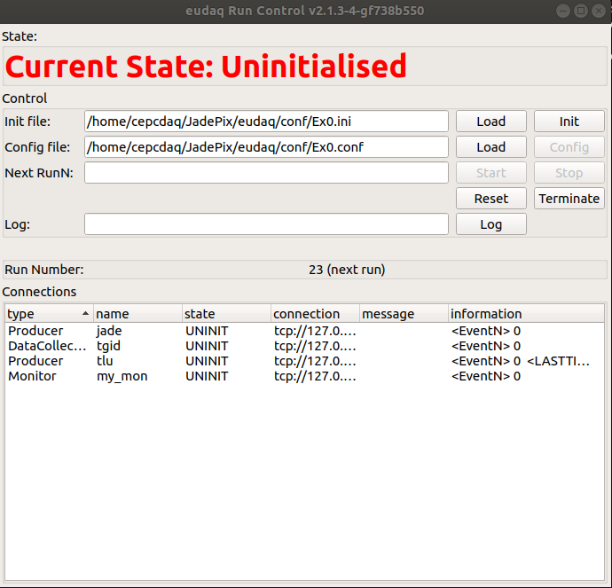

# EUDAQ with JadePixDAQ quick tutorial
## Setting environment
After openning a terminal, the first thing is to set the environment.

```bash
cd /home/cepcdaq/JadePix/
source init.sh
```

In the shell script **init.sh**, it exports the PATH to EUDAQ and JadePixDAQ
and sets the dynamic library directory.

```bash
!/usr/bin/bash

export EUDAQ_MODULE_DIR="/home/cepcdaq/JadePix/kc705/lib"
export PATH="/home/cepcdaq/JadePix/eudaq/bin:{PATH}"
export PATH="/home/cepcdaq/JadePix/kc705/bin:{PATH}"
```


## Running process

* First step. Open EUDAQ GUI

  ```bash
  euRun
  ```

A gui will open, such as the following fig.

	

* Second step. Open producers. Each producer should open in a new terminal, and remember to set the environment

  * JADE: 

    ```bash
    euCliProducer -n JadeProducer -t jade
    ```

  * TLU:

    ```bash
    euCliProducer -n TluProducer -t tlu
    ```

  * Data collector:

    ```bash
    euCliCollector -n TriggerIDSyncDataCollector -t tgid
    ```

  * Monitor

    ```bash
    StdEventMonitor -r tcp://localhost:44000 -t my_mon
    ```

* Third step. In the EUDAQ GUI, hit the button **init** to initialise, and wait the current state to **initialised**. Then hit the button **Start**, the information on the GUI will have events increasing. Hit the button **stop** to finish a run. 

## Change configuration

### JadePix

In the file *kc705/software/conf/sample_summer_tlu.json*, it has the settings of JadePixDAQ. 

* CHIP_SELECT: set the chip sector
* DELAY: set the delay mode
  * DELAY0: frame (0,1,2)
  * DELAY1: frame (-1,0,1)
  * DELAY2: frame (-2,-1,0)

```json
{
  "SystemTest":{
    "SecPerLoop": 60,
    "N_Loops": 1
  },
  "JadeManager":{
    "type":"TestManager",
    "parameter":{
      "version":2,
      "CHIP_SELECT":"CHIPA1",
      "JadeReader":{
        "type":"TestReader",
        "parameter":{
          "PATH":"/dev/xillybus_read_32"
        }
      },
      "JadeWriter":{
        "type":"EudaqWriter",
        "parameter":{
          "PATH":"/home/cepcdaq/data/test_producer",
          "DISABLE_FILE_WRITE":false
        }
      },
      "JadeFilter":{
        "type":"CdsFilter",
        "parameter":{
          "something": "somthing"
        }
      },
      "JadeMonitor":{
        "type":"TestMonitor",
        "parameter":{
          "PRINT_EVENT_N":10000,
          "PRINT_EVENT_DISCONTINUOUS":false,
          "ENABLE_CDS":true
        }
      },
      "JadeRegCtrl":{
        "type":"TestRegCtrl",
        "parameter":{
          "PATH":"/dev/xillybus_mem_8",
          "command_list":{
            "RESET":{
              "address":1,
              "default_val":15
            },
            "SET":{
              "address":2,
              "default_val":10
            },
            "START":{
              "address":3,
              "default_val":15
            },
            "STOP":{
              "address":4,
              "default_val":15
            },
            "CHIPA1":{
              "address":8,
              "default_val":0
            },
            "CHIPA2":{
              "address":8,
              "default_val":1
            },
            "CHIPA3":{
              "address":8,
              "default_val":2
            },
            "CHIPA4":{
              "address":8,
              "default_val":3
            },
            "CHIPA5":{
              "address":8,
              "default_val":4
            },
            "CHIPA6":{
              "address":8,
              "default_val":5
            },
            "CHIPA7":{
              "address":8,
              "default_val":6
            },
            "CHIPA8":{
              "address":8,
              "default_val":7
            },
            "CHIPA9":{
              "address":8,
              "default_val":8
            },
            "CHIPA10":{
              "address":8,
              "default_val":9
            }
          },
          "status_list":{
            "FIFO_MODE":{
              "address":16,
              "value_list":{
                "NOT_FULL":0,
                "FULL":1
              }
            },
            "RUN_MODE":{
              "address":16,
              "value_list":{
                "STOPPED":0,
                "STARTED":1
              }
            }
          }
        }
      }
    }
  }
}
```


### EUDAQ

In the file *kc705/software/conf/eudaq_conf/Ex0.conf*, it has the settings for EUDAQ

```ini
# example config file: Ex0.conf
[RunControl]
EX0_STOP_RUN_AFTER_N_SECONDS=60
EUDAQ_CTRL_PRODUCER_LAST_START=tlu

[DataCollector.tgid]
EUDAQ_MN=my_mon
EUDAQ_FW=native
EUDAQ_FW_PATTERN=/home/cepcdaq/data/run$3R_$12D$X
EX0_DISABLE_PRINT=1
DISABLE_PRINT=1

[Monitor.my_mon]
EX0_ENABLE_PRINT=0
EX0_ENABLE_STD_PRINT=0
EX0_ENABLE_STD_CONVERTER=1

[Producer.jade]
EUDAQ_DC=tgid

[Producer.tlu]
EUDAQ_DC=tgid
# Auto trigger with interval in units of ms
TriggerInterval = 1
# Activate DUT Channel 0 -> only telescope
DutMask = 1
# Don't power PMTs: Set Control Voltage to 0 mV
PMTVcntl1 = 0
PMTVcntl2 = 0
PMTVcntl3 = 0
PMTVcntl4 = 0

[Producer.MimosaNI]
EUDAQ_DC=tgid
# Set here the local IP of the NI crate on which MimosaDAQ (Anemone LV) is running
NiIPaddr = 192.168.22.2
#TriggerType = 1
Det = MIMOSA26
Mode = ZS2
```

